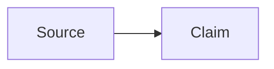

# Obsidian Flavored Markdown

Use this as a compact fallback for Obsidian-specific syntax. Prefer a separately
installed `kepano/obsidian-skills` `obsidian-markdown` skill when available,
then current [Obsidian Help](https://help.obsidian.md/), for detailed or
version-sensitive questions.

Resolve the installed product root from this skill's own location, not from the
vault or current working directory:

```bash
PRODUCT_ROOT="$(git rev-parse --show-toplevel)/vendor/claude-obsidian"
CORE="$PRODUCT_ROOT/scripts/claude-obsidian.py"
test -f "$CORE"
```

Answer syntax questions read-only. If the user requests a vault edit, draft the
complete note, read [operation-transactions.md](../co-wiki/references/operation-transactions.md),
and build one `claude-obsidian.transaction.v1` bundle with
`operation_type: markdown` and only `wiki/` targets. Inspect it, then set
`APPROVAL_SHA256` to the returned `approval_sha256` after review and apply it
through the same vault-bound plan. A canonical page create or removal includes
an active index or MOC update in that bundle; update the overview only when its
stable high-level synthesis changed:

```bash
python3 "$CORE" transaction inspect "$BUNDLE" --vault "$VAULT"
python3 "$CORE" transaction apply "$BUNDLE" --vault "$VAULT" \
  --approved-plan-sha256 "$APPROVAL_SHA256"
```

Never write a note directly.

## Properties

Use flat YAML properties and `YYYY-MM-DD` dates. Quote wikilinks inside YAML.

```yaml
---
type: concept
title: "Contextual Retrieval"
created: 2026-07-11
updated: 2026-07-11
status: developing
tags:
  - retrieval
  - ai/knowledge
aliases:
  - Context-aware retrieval
related:
  - "[[Retrieval]]"
sources:
  - "[[Anthropic Contextual Retrieval]]"
---
```

Do not nest objects in generated wiki properties. Use block lists rather than
inline YAML arrays. Quote numeric-only tag values, for example `- "2026"`, so
YAML parsers preserve them as tags instead of numbers. Keep unknown existing
properties unless the requested edit changes them.

## Wikilinks and embeds

```markdown
[[Note Name]]
[[Note Name|Display text]]
[[Note Name#Heading]]
[[Note Name#^block-id]]
[[Folder/Note Name]]

This paragraph is addressable. ^evidence-block

![[Note Name#Summary]]
![[diagram.png|480]]
![[paper.pdf#page=3]]
```

Match the target filename exactly. Use a vault-relative folder path when a
basename is ambiguous. Use standard Markdown links for external URLs; use
wikilinks for this vault's notes.

## Callouts

```markdown
> [!note]
> Supporting context.

> [!warning] Review required
> This claim has contradictory evidence.

> [!question]- Open question
> What evidence would resolve this?
```

`-` starts collapsed and `+` starts expanded. Common built-in types include
`note`, `abstract`, `info`, `todo`, `tip`, `success`, `question`, `warning`,
`failure`, `danger`, `bug`, `example`, and `quote`. Preserve custom vault
callout types rather than rewriting them.

## Other Obsidian syntax

````markdown
#inline-tag #nested/tag

==Highlighted text==

Visible text %%hidden comment%%

Inline math: $E = mc^2$

$$
\int_0^1 x^2\,dx = \frac{1}{3}
$$


````

Standard CommonMark/GFM headings, lists, tasks, tables, code fences, and
footnotes remain valid. Avoid HTML when native Markdown is sufficient.

## Validate a drafted note

- Parse the YAML boundary and keep property types consistent.
- Verify every internal target, heading, and block reference that can be
  checked locally; never fabricate a target to make a link look complete.
- Keep evidence wording distinct from inference and preserve source locators.
- Ensure code fences and callout quoting are balanced.
- Run deterministic wiki lint after a requested mutation and report remaining
  findings without silently repairing them.

For source-cited pages, also follow
[provenance.md](../co-wiki/references/provenance.md). Report the transaction
operation ID and exact changed paths after an applied edit.
